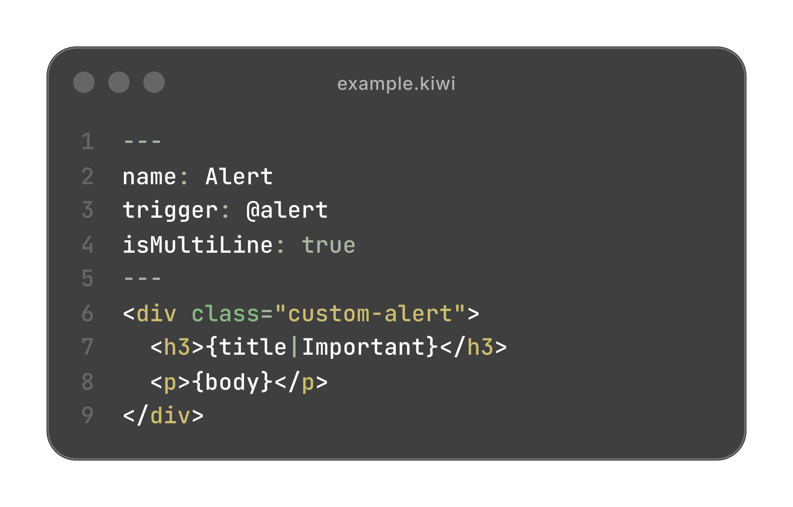
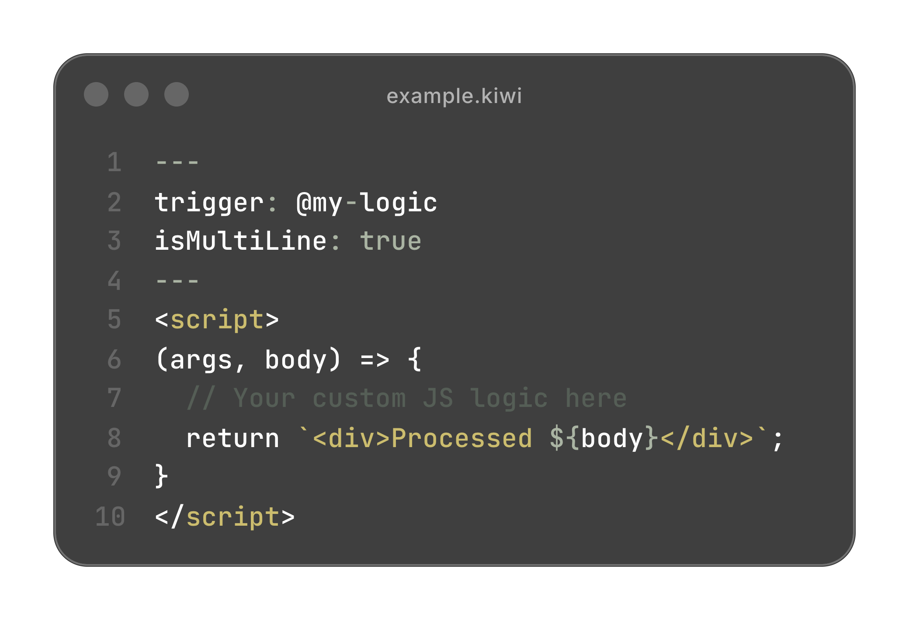

# ✨ Building with Kiwi

Kiwi Docs isn't just for static text. It supports **Building Blocks** — powerful, dynamic components that you can drop directly into your Markdown files to create rich, interactive documentation.
<!-- @alert(title="Warning" color="#ff7b72" body="Make sure to put the block in a subfolder of the project root called blocks!") -->
## 🚀 How to Write Your Markdown!

Adding dynamic content to your pages is clean and invisible to standard parsers. We use **HTML Comments** to define blocks.

### The Syntax
All blocks follow this simple pattern:

`@blockName(argument="value"; arg2="value")`

in \<\!\-\- \-\-\> comments.

### Why Comments?
1.  **Invisible Failure**: If JavaScript fails, your users see clean Markdown, not broken code.
2.  **Standard Compliant**: Works in any Markdown editor (Obsidian, VS Code, GitHub).
3.  **Clean**: Doesn't clutter your preview with weird symbols.

---

## 📦 Core Blocks Portfolio

### 🧩 Snippets Per Type (`snippets-per-type`)
Define code for multiple languages using arguments.

**How to use it:**

```markdown
<!-- @snippets-per-type(
    python="print('Hello World')";
    javascript="console.log('Hello World')";
    rust="println!('Hello World')"
) -->
```

### 📢 Alerts (`alert`)
Show a highlighted message box.

**How to use it:**
```markdown
<!-- @alert(title="Important"; body="Pass your content in the body argument!") -->
```

### 🖼️ Iframe (`iframe`)
Embed websites, demos, or videos directly into your docs.

**How to use it:**
```markdown
<!-- @iframe(src="https://example.com"; height="400px") -->
```

---

## � Advanced Markdown Features

Kiwi leverages **Marked.js** for high-performance rendering. Besides standard Markdown, we've optimized several features:

### 📸 Rich Media
You can embed images, videos, and audio using standard syntax. Kiwi automatically resolves relative paths to your GitHub repository!

| Type | Syntax |
| :--- | :--- |
| **Image** | `` |
| **Video** | `` |
| **Audio** | `` |

### 📑 Automatic Table of Contents
Every `h1`, `h2`, and `h3` is automatically scanned and added to the sidebar's **Table of Contents**. This keeps your navigation smooth and effortless.

### 🔗 Smart Linking
Links to other `.md` files (e.g., `[Setup Guide](setup.md)`) are automatically intercepted. They load instantly without a full page refresh, keeping your users in the flow.

---

## 🛠️ Creating Custom Blocks (New Format)

Kiwi now uses a simplified, file-per-block system in the `blocks/` directory. Each block is a `.kiwi` file using a Markdown-like frontmatter. This format is designed to be **AI-friendly** and **human-readable**.

### 1. The Block Structure
A `.kiwi` file consists of two parts: a YAML-like header and the HTML template.

<!-- ```markdown
---
name: Alert
trigger: @alert
isMultiLine: true
---
<div class="custom-alert">
  <h3>{title|Important}</h3>
  <p>{body}</p>
</div>
``` -->



- **`trigger`**: The @command used in Markdown.
- **`isMultiLine`**: Set to `true` if the block should capture code/text below it.
- **`{key}`**: Placeholders that are replaced by arguments (e.g., `@alert(title="Warning")`).
- **`{body}`**: Used in multi-line blocks to inject the content.

### 2. Logic-Powered Blocks
If you need complex logic (like our tabbed snippets), you can use a `<script>` tag inside the `.kiwi` file. The script should return a renderer function:

<!-- ```html
---
trigger: @my-logic
isMultiLine: true
---
<script>
(args, body) => {
  // Your custom JS logic here
  return `<div>Processed ${body}</div>`;
}
</script>
``` -->

### ⚙️ The Engine: `blocklib.js`
The heavy lifting is now handled by `host/blocklib.js`. It automatically:
1. Fetches all `.kiwi` files from your repository.
2. Compiles templates or executes scripts.
3. Injects them into your Markdown *before* parsing, ensuring a seamless experience.

---

### 💡 Best Practices for AI & Humans
- **Keep it Simple**: Use the template format `{arg}` whenever possible.
- **Self-Contained Styles**: Include `<style>` tags directly in your `.kiwi` file to keep blocks portable.
- **Namespace**: Use consistent triggers like `@ui-button` or `@dev-note`.
