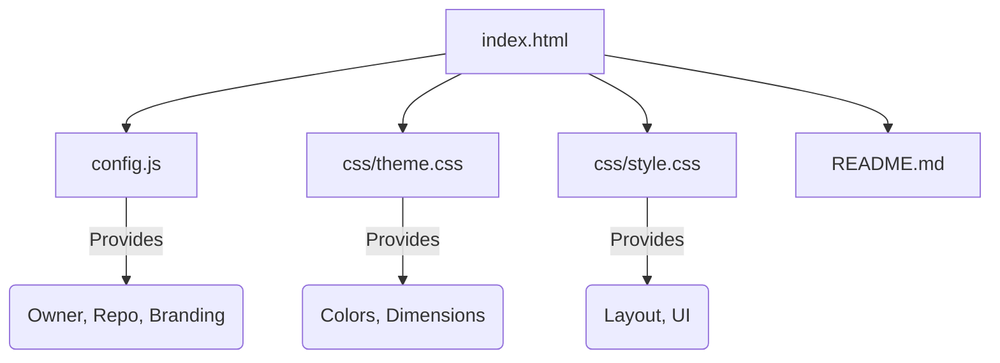

# Refactoring for Production & Theming

I have refactored the project to make it easily forkable and customizable.

## Architecture Changes

## files Created

### [config.js](file:///Users/vib/kiwi/config.js)
Contains all user-configurable settings.
- **Identity**: Owner, Repo, Branch.
- **Branding**: Titles, Logo, Welcome Message.
- **Activity Feed**: Dynamic repo targeting.

### [css/theme.css](file:///Users/vib/kiwi/css/theme.css)
Contains CSS variables for easy theming.
- Change `--accent-primary` to change the main color.
- Change `--bg-dark` to change the background.

### [css/style.css](file:///Users/vib/kiwi/css/style.css)
Contains the core styles, separated from logic.

### [README.md](file:///Users/vib/kiwi/README.md)
Instructions for new users on how to fork and set up their own documentation.

## How to Test
1. Open `index.html` in your browser.
2. Verify the title is "Team 5171 | Start Guide" (loaded from config).
3. Verify the styles are applied correctly.
4. Try changing a value in `config.js` (e.g., `branding.shortTitle`) and refresh to see the update.
